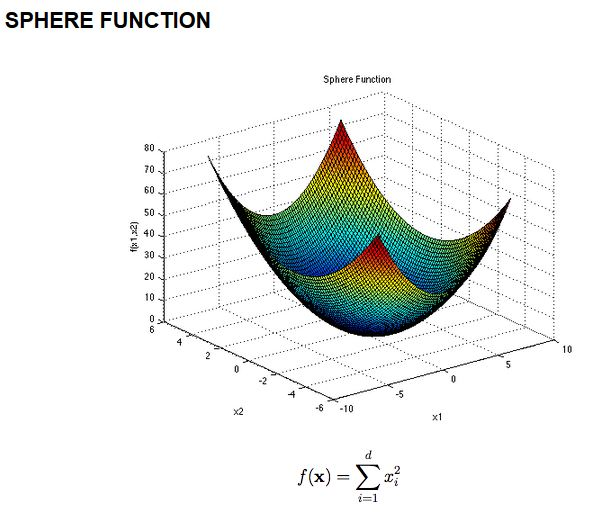

# Whale Optimization Algorithm in Data Clustering
Code for data clustering with the whale optimization algorithm combined with lamarickan learning.

## Setup environment

1. Install Python 3.8 - [Installation](https://www.python.org/downloads/release/python-380/)
2. Install Jupyterlab with `pip install jupyterlab`
3. Install the notebook with `pip install notebook`
4. Start the notebook with `jupyter notebook`

## Setup algorithm to cluster your data

1. Install the dependencies of the algorithm:
```
pip install numpy
pip install pandas
pip install sklearn
```

### Input parameters for WOA

The algorithm can be parametrized by the two values `maxIter` that defines the amount of maximum iterations the algorithm runs throug and `numPopulation` that defines the amount of whales that are inizialized by the algorithm.

```
maxIter = 600
numPopulation = 60
```

### Demonstration Video
[The Video of the Whale Optimization Algorithm can be found here!](https://youtu.be/sZUDrQZvTpg)

#### Objective Function
The objective function of the WOA is the sphere function



